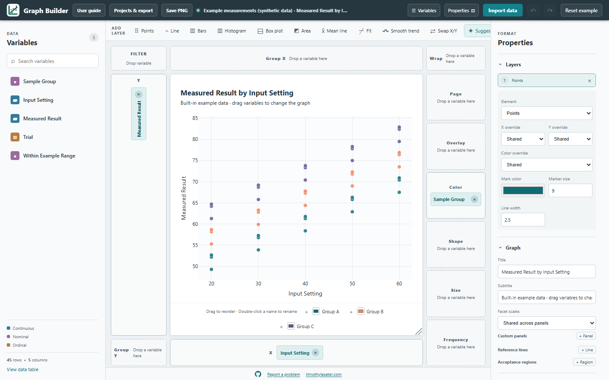
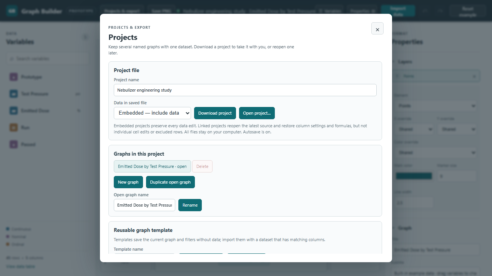

# Graph Builder user guide

Graph Builder makes graphs from a table of measurements. It runs as a Windows app or in a desktop browser. Imported data stays on your computer. The built-in example is **synthetic practice data**, made for learning the controls and unrelated to a research study. Save an embedded project before importing new data or choosing **Reset example** if you want to keep your work.

## Contents

- [First graph](#first-graph)
- [Import data](#import-data)
- [Inspect and edit the data table](#inspect-and-edit-the-data-table)
- [Variables and graph roles](#variables-and-graph-roles)
- [Layers and statistical summaries](#layers-and-statistical-summaries)
- [Compare two groups](#compare-two-groups)
- [Filters and linked selection](#filters-and-linked-selection)
- [Graph layout and appearance](#graph-layout-and-appearance)
- [Projects templates and exports](#projects-templates-and-exports)
- [Annotations in imported files](#annotations-in-imported-files)
- [Keyboard shortcuts](#keyboard-shortcuts)
- [Keyboard only workflow](#keyboard-only-workflow)
- [Troubleshooting and data privacy](#troubleshooting-and-data-privacy)

## First graph

1. Start with the synthetic example. Its graph already shows **Measured Result** against **Input Setting**, colored by **Sample Group**.
2. In **Variables**, drag a column to an X or Y box. To move a column already assigned, drag its colored label to another role, or back to **Variables**. Use the × beside a label to remove it.
3. Choose a form such as **Points**, **Bars**, or **Box plot** in **Add layer**. Click a tool to add it, or drag it onto the graph. Select a layer in **Properties → Layers** to adjust it.
4. Use **Projects & export** to save a project or export an image. **Save PNG** in the top bar saves the open graph quickly.

## Import data

Choose **Import data**, or drop a file onto the app. CSV, TSV, TXT, XLSX, and XLS files are supported. Choose the data worksheet for Excel. If a title or notes appear above the real column names, set **Rows to skip before header** to the number of rows above them. Check the header preview, then choose **Import selected data**. Press Escape or use × to close the preview without importing. Confirm the replacement of the current project. Import replaces the active dataset and graphs; **Undo** can reverse it while this session remains open.

Use a header row with distinct column names and one observation per row. Empty cells and common missing-value labels (`N/A`, `NA`, `#N/A`, `<NA>`, `null`, `none`, `nil`, `NaN`, and `missing`, ignoring letter case) become missing values. These labels do not make an otherwise numeric column import as text. The app infers numbers, text, dates, and true/false values; review the result in **View data table**. CSV quoting and separators must be valid. If a file has multiple worksheets, only the selected data worksheet is graphed; an optional `Graph Annotations` worksheet supplies reference marks.

Search **Variables** by name. The symbol beside each variable indicates continuous (numeric scale), nominal (unordered groups), or ordinal (ordered groups). Select a variable to edit its display name, unit, data type, modeling type, and value labels in **Properties → Selected column**. Enter value labels one per line as `raw value = display label`. Changing a data or modeling type can change which plot combinations are valid.

## Inspect and edit the data table

Choose **View data table** in the Variables panel. The table shows the dataset name, row and column counts, and any active filters. Use **Quality** to inspect missing-value counts and import warnings. Click a column heading to sort. The page-size selector and page controls let you move through a large table.

Double-click an ordinary cell to edit it. Calculated cells are read-only because their value comes from a formula. Use the **Exclude** or **Include** button in the Graph row column to omit or restore one row without deleting it. Click a row to select it; Ctrl-click adds or removes a row, and Shift-click selects a range. Use **Exclude selected**, **Include selected**, **Exclude visible rows**, or **Clear selection** in the toolbar. Selection also highlights the matching graph observation when the plot supports linked selection. Clicking a graph point can select its source row; Ctrl-click or Shift-click adds to the selection.

The **Filters** menu in the table offers equals, does not equal, contains, comparison, missing/non-missing, checklist, numeric range, and date range rules. Multiple rules are applied together. Under **Calculated column**, enter a new name and a formula, then choose **Add column**. Reference a column as `[column name]` or `[column ID]`; arithmetic and `abs`, `sqrt`, `log`, `exp`, `min`, `max`, and `if` are supported. For example, `[Measured Result] / [Input Setting]` divides two example columns. Under **Paste Excel data**, paste tab-separated rows with one value for each non-calculated column, then choose **Append rows**. Formulas recalculate for appended rows.

## Variables and graph roles

Drag from **Variables** into a role box, or move a label between boxes. X is the horizontal axis; Y is the vertical axis. Multiple X or Y variables can share a plot or form separate panels. Other roles are:

| Role | Effect |
| --- | --- |
| Color | Separate observations into colored series. |
| Group X / Group Y | Divide the plot into panels across columns or rows. |
| Wrap | Make a wrapped grid of panels by group. |
| Overlay | Add a series distinction on the same axes. |
| Shape | Vary point symbols by category. |
| Size | Scale point size from a numeric variable. |
| Frequency | Treat a positive count as repeated observations in supported summaries. |
| Page | Show one category at a time; use the selector above the graph to change the page. |
| Filter | Keep selected rows visible in both graph and table. |

Some roles cannot be combined. Graph Builder explains a conflict and may move an earlier assignment. **Swap X/Y** exchanges the two axes. **Suggest** chooses a suitable plot for the current variables; click it to apply the suggestion. **Undo** and **Redo** reverse or restore recent changes. **Reset example** returns to the original synthetic dataset; use **Undo** to return to the previous project while the app remains open.

## Layers and statistical summaries

Each layer is one visual form drawn from the assigned variables. Use the **Add layer** toolbar, then open **Properties → Layers** to select or remove layers and change their settings. The **Element** menu changes the active layer's form. A layer can override shared X, Y, or Color assignments. Set its mark color, marker size, and line width below the other settings.

| Layer | What it shows | Main controls |
| --- | --- | --- |
| Points | Individual observations | Marker size, color, shape/size roles |
| Line | Values connected across X | Line width and color |
| Paired plot | Each subject's values connected across X categories | Subject ID, line width and color |
| Bars | Summarized or supplied values by category | Summary, error bars, stacking |
| Histogram | Distribution of numeric values | Number of bins |
| Box plot | Median, quartiles, whiskers, and optional points | Show outliers, all points, or none |
| Area | Values filled below a line | Compatible series may be stacked |
| Mean line | A summary at each X value | Summary measure, error bars, observations |
| Fit | A fitted straight line | Equation, sample size, R², fixed intercept |
| Curve fit | A nonlinear dose–response or exponential decay curve | Model, equation, sample size, R², parameter estimates, residuals |
| Smooth trend | A centered moving average | Odd-numbered window size |

For **Bars** or **Mean line**, choose **Raw observations** when each row is a measurement. Available summaries include mean, count, sum, median, minimum, maximum, quantile, sample standard deviation (SD), and standard error (SE). A quantile is a requested percentile. Frequency weights count repeated observations. Raw SD uses `n − 1`; SE is SD divided by the square root of `n`. Confidence intervals use a two-sided Student's t calculation around a mean. A group with only one observation has no calculated uncertainty; the app shows a warning. Error bars apply to means, and stacked bars cannot have error bars.

Choose **Precomputed means and errors** when each row already supplies a mean for an X category. Assign the supplied mean to Y, then choose its error column and optional sample-size column. Select whether the error is SD, SE, or a confidence-interval half-width. For a range, choose separate lower and upper bound columns. The app uses supplied values as entered; it does not infer raw observations or recalculate supplied confidence intervals. **Value scale** can use original values, percentage of a visible series total, or percentage of a chosen control X category. Error widths scale by the same factor; a total or control value must be positive.

**Fit** can display an equation, sample size, and R², a measure of how closely a straight line follows the points. A fixed y-intercept forces the line through the entered y value. **Smooth trend** first averages repeated numeric X values, then uses the selected odd-sized window of neighboring distinct X positions. At plot edges, it uses the available neighbors. A box plot can use Y alone; clear X to show all Y observations in one box.

For a **Paired plot**, assign a categorical X column (such as Before/After), a numeric Y measurement, and choose a **Subject ID** in **Properties → Layers**. Each row is one subject's measurement at one X category. The app connects only rows with the same Subject ID within the same visible series and panel. Subjects with one valid measurement show a single point. Rows without a Subject ID are omitted; a subject with repeated measurements at the same X category is omitted with a warning instead of averaging those measurements. Filters and excluded rows affect the plot. This plot does not run a statistical test.

For **Curve fit**, assign numeric X and Y columns and select **Curve fit** as the layer. In **Properties → Layers**, choose a four-parameter dose–response curve or exponential decay. Use the **Show equation**, **Show sample size**, and **Show R²** checkboxes to place those details on the graph and its image export; they are off by default. Dose–response requires positive X values and at least six valid observations at four X values; exponential decay requires at least five valid observations at three X values. Add a **Points** layer if you want to see the observations alongside the fitted curve. The results show parameter estimates, approximate 95% confidence intervals, R² (how closely the curve follows the data), and a residual plot. Residuals are observed values minus fitted values; a pattern in them can signal a poor model choice. The fitted curve updates when you filter or exclude rows. A separate curve is fitted for each visible series and panel. Confidence intervals may be unavailable when the parameters cannot be estimated precisely.

## Compare two groups

Assign a categorical X column and a numeric Y column. Open **Properties → Compare groups**, choose **Add comparison**, then choose categories A and B. **Independent (Welch t test)** compares measurements from separate groups, including groups with different spreads. **Paired t test** matches observations by a **Subject ID** column; each subject needs one valid measurement in each selected category. Repeated measurements for the same subject and category are omitted rather than averaged.

The result shows the mean difference **B minus A**, a confidence interval (a range of plausible differences), a two-sided p value, and the sample sizes. It also appears on the graph and its image export. The calculation uses only visible, included rows and updates with filters. With grouping or multiple panels, the comparison describes all visible rows for the first shared X and Y variables. Choose the comparison before interpreting the result; this tool compares one pair of categories at a time and does not adjust p values for multiple tests.

## Filters and linked selection

Drag a variable to **Filter**, or select it and choose **Filter selected column** under **Selected column**. For categories, search the values and tick those to keep. For numeric or date columns, choose bounds, missing values, or non-missing values. **Apply filter** updates graph and table; **Clear filter** removes that rule. Click the filled Filter box to review, edit, remove, or clear all active filters. Filters hide rows from the current view; they do not delete them. The data table's Filters menu offers additional rule types.

Clicking a plotted observation can highlight its source row in the data table when that plot has a direct row link. Some summaries combine rows and therefore cannot map to a single source row. Exclusion changes calculations; selection only highlights.

## Graph layout and appearance

Open **Properties → Graph** to edit title and subtitle, choose whether multiple X or Y variables appear together or in **Subplots**, set horizontal/vertical/grid arrangement, and choose shared or independent panel scales. If both axes use subplots, each X/Y pair forms a panel. With exactly two numeric Y variables, one X variable, and a compatible layer such as Points or Line, choose **Y variables → Dual Y axes (left / right)**. The first Y variable uses the left scale; the second uses an independent right scale. The two measures use different color sets, including when a variable is assigned to Color. You can adjust each scale under **Properties → Appearance → Axes and categories**, and choose from expanded color palettes under **Marks and colors**. Dual Y axes are available for a single graph without panels or grouping. With one categorical X and compatible Bars, Points, or Box plot layers, **Collate by category** places several Y measures side by side for each category.

Choose **+ Panel** under Custom panels to build panels with different X and Y choices. Each panel can have its own title and axis titles. Leave a panel's X empty for a Y-only box plot. Group X, Group Y, Wrap, and layer X/Y overrides pause while custom panels or axis subplots are shown; removing those panels restores the earlier assignments. Double-click a displayed graph title, subtitle, panel title, or axis title to edit it directly; Enter saves, Escape cancels.

Use **Properties → Graph** for graph grid controls, **Figure size and theme** for width, height, aspect ratio, theme, and font, **Axes and categories** for scale, limits, titles, and category order, and **Marks and colors** for symbols, opacity, line style, bars, error bars, palettes, and legend placement. The legend can hide/show a series with a click. Double-click a legend name to rename it; drag names to reorder them. Each legend entry has a color control. Click a data point to locate its source row when possible.

In **Figure size and theme**, choose Light, Print ready, or Dark. Enter width and height in pixels to use a fixed canvas, or leave them blank to fit the workspace. An aspect ratio sets width relative to height. Choose Segoe UI, Arial, or Georgia and set the graph font size. These choices are saved with the graph and used in exports.

In **Axes and categories**, give each axis a title or leave it blank to use the column name and unit. Choose a linear/date or logarithmic scale; log scales require positive values. Set a tick interval, minimum, or maximum when the automatic choice is unsuitable. **Reverse direction** flips an axis and **Include zero** keeps zero in its range. Category order can follow the data, alphabetical order, highest mean response first, or a manual order. For manual order, use the up/down buttons beside each category.

In **Marks and colors**, set the default marker shape, opacity, box-point jitter, and line style. Adjust bar gap and width, error-bar cap width and line thickness, and choose whether errors match the series color or use a custom color. Select a Standard, colorblind-accessible, or monochrome palette. To use a custom palette, enter comma-separated six-digit hex colors such as `#0f6c75, #ef8354` and move out of the field to apply them. Place the legend above, below, or to the right of the graph, or hide it. Per-layer mark color and size settings can override these defaults.

The handles on the right and bottom edges of the graph change its width or height; the corner changes both. **Fit canvas** returns it to the available space. Drag the vertical dividers to resize Variables and Properties; the top buttons can hide either sidebar. Panels scroll independently.

For a target value or acceptable interval, use **Properties → Graph → Reference lines / Acceptance regions**. Choose X or Y and enter numeric coordinates, an optional label, and a color. These marks describe the graph and do not count as observations.

## Projects templates and exports

Open **Projects & export**. One project contains one dataset and one or more named graphs. Choose **New graph**, **Duplicate open graph**, or another graph name to switch graphs; **Rename** changes a graph name, and **Delete** asks for confirmation. The final graph cannot be deleted. Undo can restore a deletion while the project remains open.

Under **Figure layout**, choose **Open layout** to arrange up to four saved graphs on one page. Select the graphs, drag the ⋮⋮ handle to reorder them, or use ↑ to move a graph earlier with a mouse or keyboard. Choose one or two columns and set the page title and size. **Download figure PNG** (or **Save figure PNG** in Windows) exports the combined page with each graph's legend. If the page is too short for the selected number of graphs, increase its height or use fewer graphs so their axes remain readable. The layout arrangement is saved in the project file; graph edits appear in the page preview when you reopen it. Removing a graph from the project also removes it from the layout.

The Project file section shows whether the current project is embedded or linked, and **Data in saved file** starts with that mode selected. Give the project a name and choose a save mode. Press Enter in **Project name** to start saving, or choose **Save project…**. In the Windows app, a Save project dialog lets you confirm **Embedded** or **Linked** before opening the Windows file-location picker.

- **Embedded — include data** saves a `.graphbuilder` file with data rows, edits, formulas, annotations, graphs, and filters. Use this for a reproducible backup or to move between computers.
- **Linked — reconnect source** saves graph and column settings without source rows. It requires the original compatible CSV or Excel file when reopened. Individual cell edits and excluded rows are not retained. The Windows app records the source path; if one is missing, it asks you to choose the original data file before saving. Projects & export shows the source location to be saved. If reconnection is needed, the prompt shows where the source was last found, and **Choose source file…** starts in that folder when it is still available. A browser shows the last known filename because it cannot access the folder path, then asks you to choose the source again. The built-in example cannot be saved as linked data.

Choose **Open project…** to reopen a `.graphbuilder` file, or drag it from File Explorer onto the app. Older `.graphbuilder.json` files can also be opened. The desktop app can also open these files when you double-click them in Windows, whether the app is running or closed. If the current project has changed since it was last saved, choose **Save current project and open** to keep an embedded copy, **Discard edits and open** to replace the current work, or **Cancel opening** to stay where you are. An unchanged saved project or the untouched built-in example opens without that prompt. In the Windows app, saving before opening updates the current `.graphbuilder` file if it already has one; otherwise it asks where to save. If you open the new file, **Undo** restores your previous project during the current session. An invalid file shows a prominent error dialog and leaves the current project untouched. The app makes a local recovery copy and may offer it on the next launch. Browser storage can be cleared, so keep an embedded project file for important work. Older browser-only saved graphs can be downloaded as templates from **Previous saved graphs** when available.

**Download template** saves only the open graph's settings and filters; it contains no data. After importing a compatible dataset, choose **Open template…** to create a graph using that design. Matching column IDs and types matter.

The Windows app lists recent projects in **Projects & export**. Reopen one from the list, or use **Open project…** to browse for a file. **Clear recent projects** removes the list without deleting project files. **Check for updates** looks for a signed release when online and offers a choice before installing. Save an embedded project first; installing an update closes the app. You can keep using the current version. The browser version has no desktop updater.

In the Windows app, press **Ctrl+S** to save an embedded copy of the current project. If the project was opened from or saved to a file during this session, Ctrl+S updates that file; otherwise the Save project dialog lets you choose a data mode and location. Press **Ctrl+Shift+S** to choose a data mode and new file location. An embedded save includes data edits even if the opened file was linked to a source. If you want to keep a linked project instead, use the Save project dialog or **Projects & export → Data in saved file**.

Press **Ctrl+O** in the Windows app to choose either a data file or a `.graphbuilder` project from one file dialog. Data files follow the usual import and worksheet steps; project files show the save-or-cancel prompt before replacing the open project.

Under **Export open graph**, set width and height in pixels. Save or download PNG, choose 1×–3× image resolution, or export SVG for scalable artwork. **Copy PNG** uses the clipboard when supported. **Export plotted data CSV** saves the currently plotted values and uncertainty, rather than the complete source table. The top-bar **Save PNG** uses the current graph size at 2× resolution.

## Annotations in imported files

Imported annotation rows create reference lines and acceptance regions without adding measurements. Coordinates must be numeric. Header names and type/axis values are case-insensitive.

For CSV or a normal Excel data worksheet, include `GB Type` and `GB Axis`; optional columns are `GB Value`, `GB Minimum`, `GB Maximum`, `GB Label`, and `GB Color`. Leave `GB Type` blank or use `data` for a measurement. Use `reference-line` with an X or Y axis and `GB Value` for a line; use `acceptance-region` with `GB Minimum` and `GB Maximum` for a shaded interval. Color is an optional six-digit hex value such as `#c2413b`. See [annotated-study.csv](https://github.com/timlasater/graph-builder/blob/main/examples/annotated-study.csv).

| Setting | Result | GB Type | GB Axis | GB Value | GB Minimum | GB Maximum | GB Label |
| ---: | ---: | --- | --- | ---: | ---: | ---: | --- |
| 20 | 51 | data | | | | | |
| | | reference-line | Y | 50 | | | Target |
| | | acceptance-region | Y | | 45 | 55 | Example range |

Alternatively, put annotations in an Excel worksheet named `Graph Annotations`, with headers `Type`, `Axis`, `Value`, `Minimum`, `Maximum`, `Label`, `Color`, and optionally `Target Sheet`. Set `Target Sheet` to the exact data worksheet name to limit an annotation to that sheet; leave it blank to apply it to every data sheet. Tagged rows and a separate annotation sheet may be combined. Invalid rows appear as warnings in **View data table → Quality** and are never counted as measurements.

## Keyboard shortcuts

| Keys | Action |
| --- | --- |
| Tab / Shift+Tab | Move to the next / previous control. |
| Enter or Space | Activate a focused button, checkbox, or section heading. |
| Arrow keys | Change a focused menu, radio choice, or number control using the browser's normal behavior. |
| Escape | Close the user guide, data table, or filter dialog; cancel opening a project or an in-place title or legend edit. |
| Enter | Save an in-place title or legend edit; apply a filter while editing its dialog. |
| F2 | Rename a focused legend series. |
| Left / Right Arrow | Reorder a focused legend series. |
| Arrow keys on a resize handle | Resize the graph or a sidebar in small steps. |
| Ctrl+click / Shift+click | Add or range-select data-table rows with a pointer. |
| Ctrl+N | In the Windows app, create a new empty graph in the current project. In the browser, use **Projects & export → New graph**. |
| Ctrl+D | In the Windows app, open the data table. In the browser, use **View data table**. |
| Mouse Back / Forward | In the Windows app, undo / redo a graph change outside text fields and dialogs. Browser mouse navigation varies by browser. |
| Ctrl+Z / Ctrl+Y | Undo / redo a graph or project change when focus is outside an editable field or dialog. On macOS, use Command instead of Ctrl. |
| Ctrl+S / Ctrl+Shift+S | In the Windows app, save the current project / save it to a new location when focus is outside an editable field or dialog. |
| Ctrl+O | In the Windows app, choose a data file to import or a project file to open. |
| Ctrl+E | In the Windows app, open **Projects & export** when focus is outside an editable field or dialog. |
| ? | Show a compact list of keyboard shortcuts in the browser or Windows app. The top bar also has a **Keyboard shortcuts** button. |

**Undo** and **Redo** are also top-bar buttons. In a text field or data table, Ctrl+Z and Ctrl+Y remain available for that field's own editing behavior. Browser shortcuts such as Ctrl+N, Ctrl+D, and Ctrl+S belong to the browser; they do not create a graph, open the data table, or save a Graph Builder project.

## Keyboard only workflow

1. Press **Tab** until a variable in **Variables** is focused. Press **Enter** or **Space** to select it. If needed, use the **Search variables** field first.
2. Tab to **Properties → Selected column**. Expand it with Enter or Space if collapsed. In **Assign selected column to**, choose a role with arrow keys, then Tab to **Assign** and press Enter. Repeat for each variable. This replaces dragging for all assignment roles.
3. To remove an assignment, Tab to its × button and press Enter. To filter, select a variable, Tab to **Filter selected column**, and press Enter; move through the dialog with Tab and Space, then activate **Apply filter**.
4. Tab to an **Add layer** button and press Enter. In **Properties → Layers**, select a layer, then use its labeled controls. Use the top **Undo**, **Redo**, and **Projects & export** buttons as needed.
   To change graph titles or axes without double-clicking the picture, use the text fields in **Graph** and **Axes and categories**. To hide a series, focus its legend button and press Enter or Space. Press F2 to rename that series, or Left/Right Arrow to reorder it.
5. For the data table, Tab to **View data table**, press Enter, then Tab through toolbar actions and use AG Grid's normal cell keyboard navigation. Press Escape to close. Use the **Include in graph** checkboxes or toolbar buttons to change row inclusion.
6. Resize the graph with its labeled width, height, and corner handles using arrow keys. Resize sidebars with their labeled divider controls using Left/Right Arrow. Legend labels use Left/Right Arrow for ordering and F2 for renaming.
7. Tab to **Projects & export** to save or export. In a desktop file dialog, use Windows keyboard navigation; in a browser, use the browser's file chooser or download controls. After a dialog closes, focus returns to the app.

Native drag-and-drop has no general keyboard equivalent, so the selected-column assignment controls are the intended keyboard route. The graph preview has a text summary for screen readers. If a keyboard route fails for a particular feature, report it through **Report a problem** with the control name and steps.

## Troubleshooting and data privacy

If import fails, the current dataset remains in place. Check the source file's headers, separators, quoting, and worksheet selection. If a linked project cannot reconnect, choose the original source file or save an embedded copy from a working session. If you replace data unexpectedly, use **Undo** before closing the app. A display failure offers **Reload Graph Builder**; reopen your last embedded project afterward if needed.

The browser app needs a connection to load its code, but row data and local recovery stay on your device. The installed Windows app can run its core graphing workflow offline. Update checks require a connection and can be declined. Exported files go only where you choose. When reporting an issue, provide a small synthetic dataset rather than private research data.
